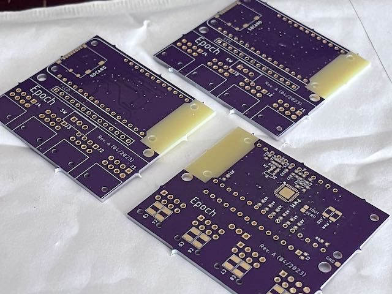
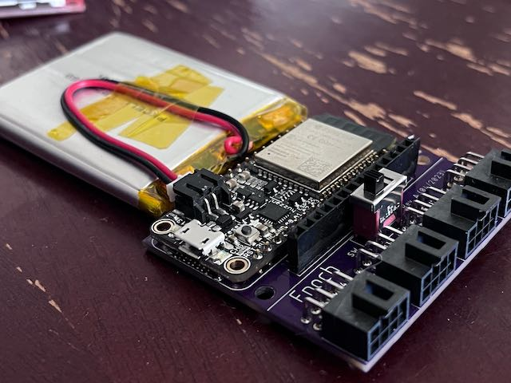
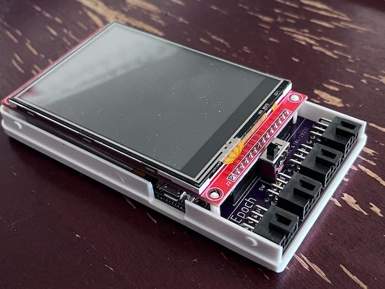
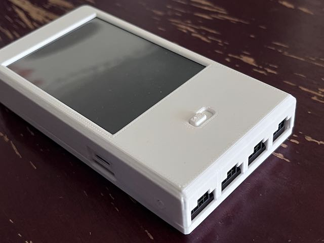
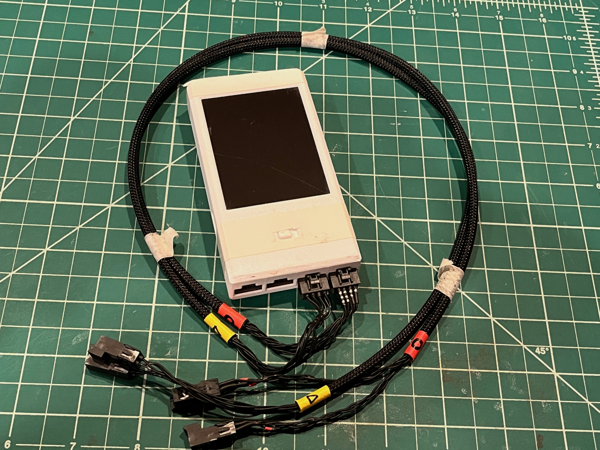
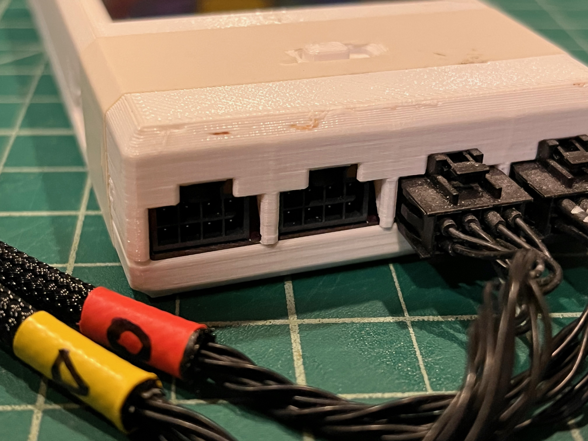
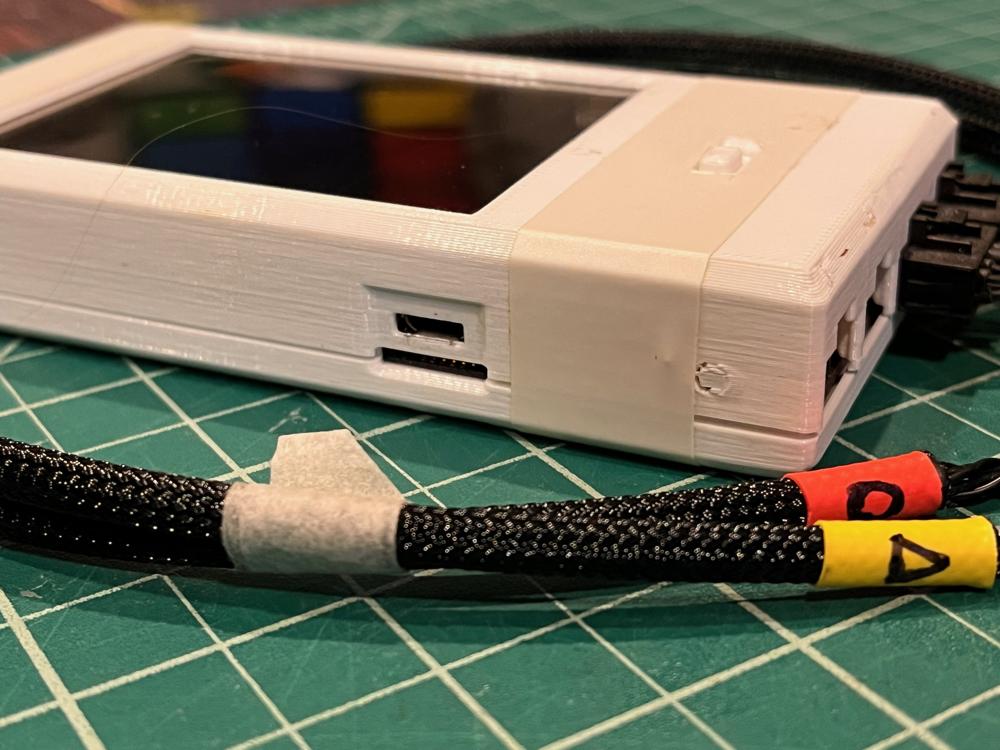
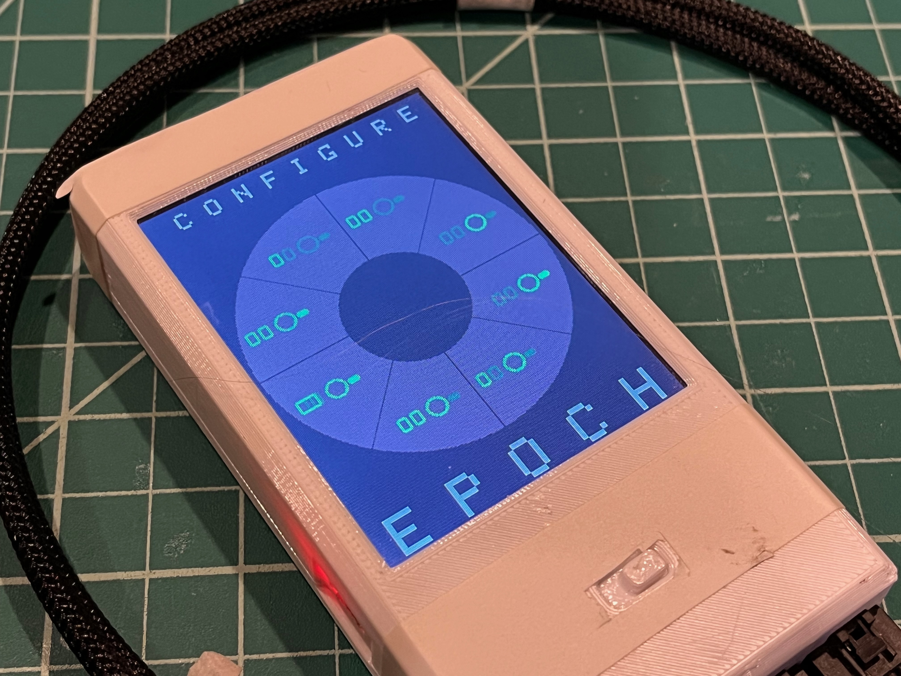
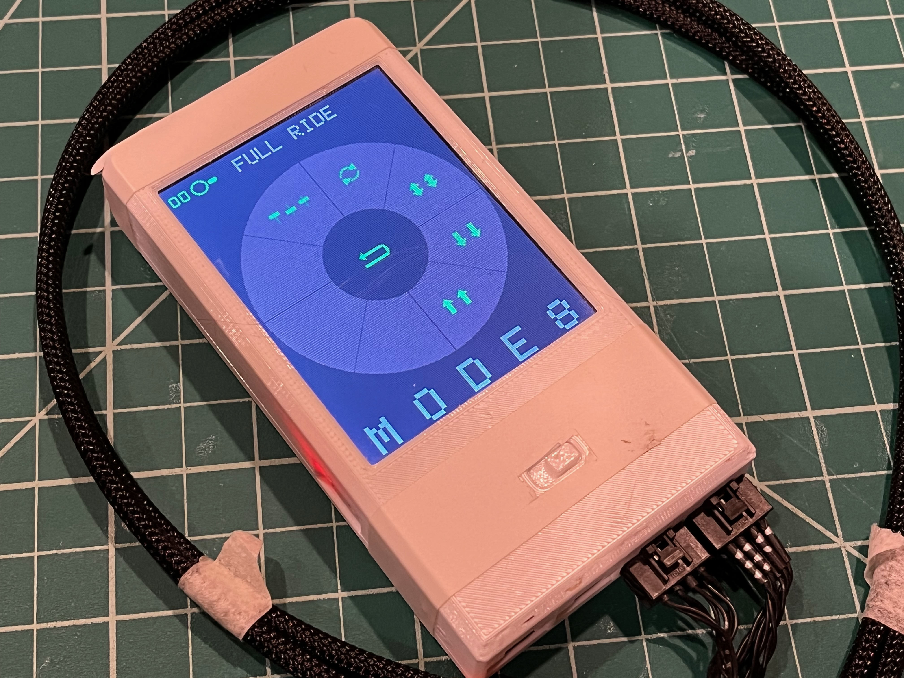
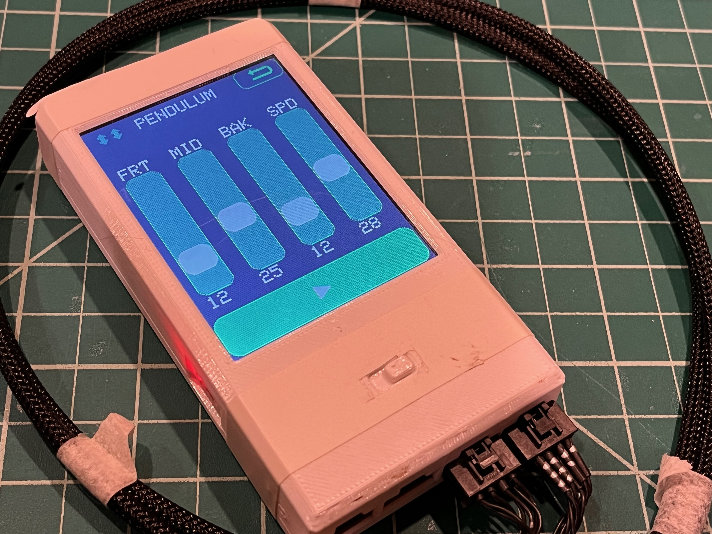

# Epoch 1
A 16 channel hand-held vibrator controller (haptic field emitter). With LCD Touch Screen and SD Card reader. Replaced by [Epoch-2](https://github.com/CircuitMonkey/epoch-2)

## Features
 - TFT Touch Display - 320x240 - 3.2inch - SPI Type - Resistive Touch
 - Adafruit Huzzah32 ESP Controller Board (#3405)
 - TLC59401RHB SPI PWM Channel Driver
 - LiPo Battery - 62mm x 50mm, 2500mAH, Adafruit (#328)
 - Molex MiniFitJr type connectors with custom cables.
 - Programmed in Arduino
 - Approximate size of original Apple iPod.

## Dev Notes
 - Huzzah has on-board LiPo charger which made integration simple.
 - Choice of Molex MinifitJr type connectors was cumbersome in use.
 - Choice of Molex MinifitJr type connectors made custom cable fabrication time consuming.
 - This platform performed well for almost a year, before Epoch-2 developed.
 - Never used SD card. Removed off future designs.
 - Choice of TLC59401RHB was cumbersome in coding. Moved to I2C type PWM chip in future Epoch designs.
 - Choice of TLC59401RHB limited motor size as only could source 120mA per channel. Added power FETs to future Epoch designs.

